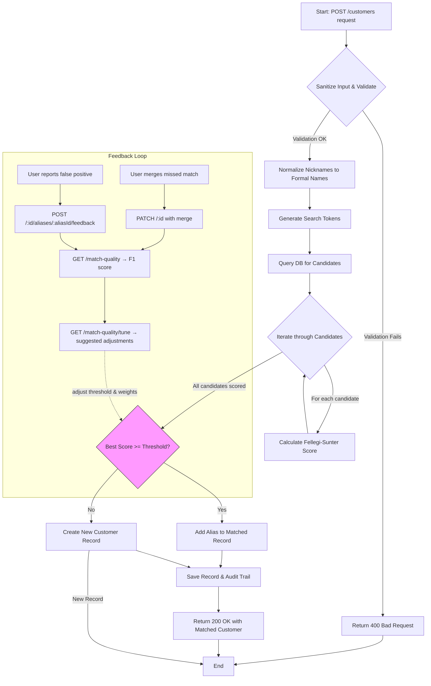

# S14S Identify

**Enterprise Identifier Registry** — a REST API for consolidating customer identities across multiple source systems using probabilistic record linkage.

When different systems (CRM, billing, support, etc.) each maintain their own customer records, S14S Identify serves as a single source of truth. It uses the **Fellegi-Sunter** model to determine whether an incoming record refers to an existing person, and links them automatically via an aliases array.

## Table of Contents

- [Quick Start](#quick-start)
- [API Overview](#api-overview)
- [Customer Matching](#customer-matching)
  - [Fellegi-Sunter Model](#fellegi-sunter-model)
  - [Jaro-Winkler Distance](#jaro-winkler-distance)
  - [Field Configuration](#field-configuration)
  - [Match Threshold and F1 Tuning](#match-threshold-and-f1-tuning)
- [Match Quality and F1 Feedback Loop](#match-quality-and-f1-feedback-loop)
  - [Metrics](#metrics)
  - [Weight Tuning](#weight-tuning)
  - [Review Queue](#review-queue)
- [Nickname Normalization](#nickname-normalization)
- [Typeahead Search](#typeahead-search)
- [Search Tokens and Candidate Blocking](#search-tokens-and-candidate-blocking)
  - [Token Design](#token-design)
  - [Double Metaphone](#double-metaphone)
- [Input Sanitization](#input-sanitization)
  - [E.164 Phone Normalization](#e164-phone-normalization)
  - [Address Standardization (USPS Pub 28)](#address-standardization-usps-pub-28)
- [Audit Trail](#audit-trail)
- [Soft Deletes](#soft-deletes)
- [Data Model](#data-model)
- [Testing](#testing)
- [Project Structure](#project-structure)

---

## Quick Start

```bash
# Install dependencies
npm install

# Start MongoDB (via Docker)
docker compose up -d

# Seed 1000 sample customers
npm run seed

# Run the server
npm start

# Run tests with coverage
npm test

# Run build (enforces 100% coverage)
npm run build
```

The Swagger UI is available at `http://localhost:3000/api-docs` once the server is running.

---

## API Overview

All endpoints are served under `/customers`. The `x-user-id` header identifies who is performing the action (used for audit tracking).

| Method | Endpoint | Description |
|--------|----------|-------------|
| `POST` | `/customers` | Create or match a customer |
| `GET` | `/customers` | List all active customers (`?under_review=true` for review queue) |
| `GET` | `/customers/search?q=` | Typeahead search by name prefix |
| `GET` | `/customers/:id` | Get a customer by ID (`?source_system=` for original record) |
| `PUT` | `/customers/:id` | Update a customer |
| `PATCH` | `/customers/:id` | Merge another customer into this one |
| `DELETE` | `/customers/:id` | Soft delete a customer |
| `GET` | `/customers/:id/aliases` | Get cross-system identity links |
| `GET` | `/customers/:id/changes` | Get change history |
| `POST` | `/customers/:id/aliases/:aliasId/feedback` | Report a false positive match |
| `GET` | `/match-quality` | F1 score, precision, and recall metrics |
| `GET` | `/match-quality/tune` | Suggested weight adjustments based on feedback |
| `GET` | `/match-quality/feedback` | List match feedback records |

### POST Behavior

The `POST /customers` endpoint does not blindly create records. It runs every incoming record through the Fellegi-Sunter matching algorithm against all existing customers:

- **Score >= threshold (currently 95% confidence)** — the record is identified as an existing person. The incoming data is added as an alias to the matched record, and the API returns `200` with the existing customer.
- **Score < threshold** — a new customer record is created with the incoming data as its first alias. The API returns `201`.

This means source systems can POST freely without worrying about duplicates. The matching engine handles deduplication automatically. First names are [normalized from nicknames to formal equivalents](#nickname-normalization) before matching (e.g., "Chuck" becomes "Charles"), while the original name is preserved in the alias's `original_payload`.

The threshold is not a fixed constant — it is tunable via the [F1 feedback loop](#match-quality-and-f1-feedback-loop) based on real-world match accuracy.

### Logic Flow

The following diagram illustrates the control flow for the `POST /customers` endpoint:



1.  **Sanitization**: All incoming data is cleaned, validated, and [nickname-normalized](#nickname-normalization).
2.  **Token Generation**: Search tokens (phonetic, prefix, exact) are created from the sanitized data.
3.  **Candidate Blocking**: The database is queried for records sharing at least one token. This is a highly efficient indexed operation (`O(log N)`).
4.  **Scoring**: The small set of candidates (`C`) is scored using the Fellegi-Sunter algorithm.
5.  **Decision**: Based on the highest score vs. the current threshold, the system either links an alias or creates a new record.
6.  **Feedback Loop**: Users report false positives (incorrect matches) or perform manual merges (false negatives). The F1 metrics endpoint computes precision and recall, and the tuning endpoint suggests threshold and weight adjustments.

---

## Customer Matching

### Fellegi-Sunter Model

The matching engine implements the [Fellegi-Sunter model](https://courses.cs.washington.edu/courses/cse590q/04au/papers/Fellegi69.pdf) (1969), the foundational framework for probabilistic record linkage used across government agencies, healthcare systems, and financial institutions worldwide.

The core idea: for each comparison field, we define two probabilities:

- **m-probability** `P(agree | true match)` — how often this field agrees when two records truly refer to the same person
- **u-probability** `P(agree | not a match)` — how often this field agrees purely by coincidence among unrelated records

From these, we compute:

- **Agreement weight** = `log2(m / u)` — reward for a field matching. Fields that are highly distinctive (low u) produce large positive weights.
- **Disagreement weight** = `log2((1 - m) / (1 - u))` — penalty for a field not matching. Fields with high m produce large negative penalties when they disagree.

The raw composite score is converted to a normalized probability between 0 and 1:

```
P(match) = (score - minPossibleScore) / (maxPossibleScore - minPossibleScore)
```

Where `maxPossibleScore` is the sum of all agreement weights (perfect match) and `minPossibleScore` is the sum of all disagreement weights (complete mismatch).

### Jaro-Winkler Distance

For name and address fields, exact matching is too rigid — typos, abbreviations, and data entry inconsistencies are common. The engine uses [Jaro-Winkler distance](https://en.wikipedia.org/wiki/Jaro%E2%80%93Winkler_distance) for fuzzy string comparison.

Jaro-Winkler is specifically designed for short strings like names. It:

1. Computes the **Jaro similarity** based on the number and order of matching characters
2. Applies a **Winkler prefix bonus** that gives extra weight to strings sharing a common prefix (reflecting the empirical observation that typos are less common at the start of a name)

The result is a similarity score between 0 (completely different) and 1 (identical). Each field has a configurable similarity threshold that determines whether the comparison counts as "agreement."

For email and phone fields, exact matching is used — these identifiers are either right or wrong.

### Field Configuration

| Field | m | u | Compare | Threshold | Rationale |
|-------|---|---|---------|-----------|-----------|
| `first_name` | 0.95 | 0.005 | Jaro-Winkler | 0.85 | True matches agree 95% of the time; random pairs share a first name ~0.5% |
| `last_name` | 0.95 | 0.002 | Jaro-Winkler | 0.85 | Last names are more distinctive than first names |
| `email` | 0.90 | 0.0001 | Exact | 1.0 | Emails are nearly unique; lower m accounts for people with multiple addresses |
| `phone` | 0.85 | 0.0005 | Exact | 1.0 | Phones change more often; still highly distinctive |
| `address_composite` | 0.80 | 0.005 | Jaro-Winkler | 0.80 | Addresses change frequently; composite of street, city, state, zip |

The `email` field carries the most discriminating power due to its extreme m/u ratio — an email match provides strong evidence, while an email mismatch is heavily penalized.

### Match Threshold and F1 Tuning

The match threshold is currently set at **0.95** (95% confidence). Rather than relying on a fixed value chosen once, the threshold is designed to be tuned over time using the [F1 feedback loop](#match-quality-and-f1-feedback-loop).

The initial threshold favors minimizing false positives — incorrectly merging two distinct people is far more damaging than creating a duplicate record that can be merged later. As real-world feedback accumulates, the `/match-quality/tune` endpoint analyzes the ratio of false positives to false negatives and suggests adjustments:

- **Too many false positives** (incorrect merges): raise the threshold and tighten field weights
- **Too many false negatives** (missed matches): lower the threshold and loosen field weights

When both records have no overlapping data (all fields empty), the score is 0. Fields where both records are missing are skipped entirely — they neither help nor hurt the score.

---

## Match Quality and F1 Feedback Loop

The matching engine is not a black box — it has a built-in feedback system that measures accuracy and suggests improvements. This closes the loop between automated matching and human review.

### Metrics

`GET /match-quality` computes precision, recall, and F1 score from accumulated feedback:

| Metric | Formula | Meaning |
|--------|---------|---------|
| **Precision** | TP / (TP + FP) | Of all auto-matches, how many were correct? |
| **Recall** | TP / (TP + FN) | Of all true matches, how many did the system find? |
| **F1** | 2 * P * R / (P + R) | Harmonic mean — balances precision and recall |

Where:
- **True Positive (TP)**: system matched correctly (auto-match with no false positive feedback)
- **False Positive (FP)**: system matched incorrectly (reported via `POST /:id/aliases/:aliasId/feedback`)
- **False Negative (FN)**: system missed a match (detected when a manual merge is performed via `PATCH /:id`)

Manual merges automatically record a `false_negative` feedback entry, so the system learns from both explicit feedback and operational corrections.

### Weight Tuning

`GET /match-quality/tune` analyzes the balance of false positives vs. false negatives and returns:

- Current field weights (m/u values) and threshold
- Suggested adjustments (small 1-2% changes to avoid oscillation)
- Rationale for the suggestion

The tuning endpoint is advisory — it does not auto-apply changes. This gives operators visibility into how the system would adjust and the opportunity to review before applying.

| Feedback Pattern | Action | Effect |
|-----------------|--------|--------|
| FP > 50% of feedback | **Tighten** | Raise threshold +1%, reduce m values, increase u values |
| FN > 50% of feedback | **Loosen** | Lower threshold -1%, increase m values, reduce u values |
| Balanced | **None** | No adjustment needed |

### Review Queue

`GET /customers?under_review=true` returns customers with unresolved false positive feedback, ordered by most recent feedback first. This provides a work queue for operators to review and resolve disputed matches.

Feedback records can be filtered via `GET /match-quality/feedback?resolved=false` to see only unresolved items.

---

## Nickname Normalization

Common nicknames and diminutives are automatically normalized to their formal equivalents on ingestion. This improves match recall — a record submitted as "Chuck" will match an existing "Charles" because both are stored under the same canonical name.

| Nickname | Stored As | | Nickname | Stored As |
|----------|-----------|-|----------|-----------|
| Chuck | Charles | | Bill | William |
| Bob | Robert | | Mike | Michael |
| Jim | James | | Liz | Elizabeth |
| Becky | Rebecca | | Kate | Katherine |

The dictionary covers ~130 common English nicknames (both male and female). Names not in the dictionary are stored as-is.

The original name is always preserved in the alias's `original_payload` field. To retrieve the original record as submitted by a specific source system, use:

```
GET /customers/:id?source_system=CRM
```

This overlays the `original_payload` fields from the matching alias onto the response, returning `first_name: "Chuck"` instead of the canonical `first_name: "Charles"`.

Typeahead search also expands nicknames — searching for "chuck" will query both "chuck" and "charles" prefix tokens.

---

## Typeahead Search

`GET /customers/search?q=jo&limit=20` provides fast prefix-based name search optimized for 10M+ records. The search uses indexed prefix tokens (`fp:` and `lp:`) for `O(log N)` lookups — no collection scans.

- Minimum query length: 2 characters
- Matches against the beginning of `first_name` or `last_name`, case-insensitive
- Excludes soft-deleted customers
- Default limit: 20, max: 100
- Nicknames are expanded (searching "chuck" also matches "charles" prefix tokens)

Prefix tokens are generated at ingestion time for every substring from length 2 to full name length. For example, "John" produces tokens `fp:jo`, `fp:joh`, `fp:john`. These are stored in the same `search_tokens` array and backed by the same compound index used for match candidate blocking.

---

## Search Tokens and Candidate Blocking

Running Fellegi-Sunter against every record in the database doesn't scale. The standard solution in record linkage is **blocking** — narrowing the candidate set before scoring. S14S Identify uses phonetic search tokens stored directly on each customer document and backed by a MongoDB multikey index.

When a new record arrives, the system generates tokens from the incoming data, queries for any existing customers sharing at least one token (`$in`), and only runs Fellegi-Sunter against those candidates. This means the matching engine touches a small fraction of the database regardless of total size.

### Token Design

Each customer stores a flat `search_tokens` array of prefixed strings:

```
["fn:JN", "fn:AN", "fp:jo", "fp:joh", "fp:john", "ln:SM0", "lp:sm", "lp:smi", "lp:smit", "lp:smith", "em:john", "ed:example.com", "ph:5309", "ph:8675309", "sn:123", "ss:MN", "zp:62701"]
```

Prefixes prevent cross-field collisions (e.g., a ZIP code matching a phone suffix). A single compound index on `{ search_tokens: 1, deleted_at: 1 }` handles all token lookups efficiently.

| Field | Prefix | Token Logic |
|-------|--------|-------------|
| `first_name` | `fn:` | Double Metaphone primary + alternate (if different) |
| `first_name` | `fp:` | Lowercased prefix substrings (length 2 to full) for typeahead |
| `last_name` | `ln:` | Double Metaphone primary + alternate (if different) |
| `last_name` | `lp:` | Lowercased prefix substrings (length 2 to full) for typeahead |
| `email` | `em:`, `ed:` | Lowercased local part and domain |
| `phone` | `ph:` | Last 4 digits and last 7 digits of E.164 number |
| `address.street` | `sn:`, `ss:` | Street number (exact) + Double Metaphone of street name words |
| `address.zip` | `zp:` | First 5 digits of ZIP code |

Tokens use **any-match** semantics (`$in`) for maximum recall — a single shared token is enough to pull a candidate into the scoring pool. Fellegi-Sunter then handles precision by computing a rigorous probabilistic score across all fields.

Street name tokenization skips common USPS suffix words (ST, AVE, BLVD), directionals (N, S, E, W), secondary unit designators (APT, STE), and single-character words, since these are too common to be discriminating.

### Double Metaphone

Phonetic tokens are generated using the [Double Metaphone](https://en.wikipedia.org/wiki/Metaphone#Double_Metaphone) algorithm, which encodes how a word *sounds* rather than how it's spelled. This enables matching across common name variations:

| Name | Primary | Alternate |
|------|---------|-----------|
| Michael | MKL | MXL |
| Smith | SM0 | XMT |
| Schmidt | XMT | SMT |

Double Metaphone produces two encodings — a primary and an alternate — to handle words with ambiguous pronunciation. Both are stored as tokens when they differ, maximizing recall. Notice how "Smith" and "Schmidt" share the code `XMT`, which means a search for either name will surface the other as a candidate.

### Address Standardization (USPS Pub 28)

Before token generation, all addresses are standardized according to [USPS Publication 28](https://pe.usps.com/text/pub28/welcome.htm), the postal addressing standard. This ensures consistent tokenization regardless of how the address was originally entered.

| Input | Standardized |
|-------|-------------|
| `123 Main Street` | `123 Main ST` |
| `North Oak Avenue` | `N Oak AVE` |
| `456 Elm Boulevard Apartment 4` | `456 Elm BLVD APT 4` |
| `789 Cedar Blvd.` | `789 Cedar BLVD` |

The standardizer normalizes:

- **Street suffixes** — "Street" to "ST", "Avenue" to "AVE", "Boulevard" to "BLVD", etc.
- **Directionals** — "North" to "N", "Southwest" to "SW", etc.
- **Secondary unit designators** — "Apartment" to "APT", "Suite" to "STE", etc.
- **ZIP+4 formatting** — "627011234" to "62701-1234"
- **Periods and extra whitespace** — "St." to "ST", multiple spaces collapsed

Standardization is applied during input sanitization, so all stored addresses are already in canonical form.

---

## Input Sanitization

All input is sanitized before storage or matching. The sanitization layer validates and normalizes data, returning an array of all validation errors at once rather than failing on the first error.

**POST validation requires:**
- `source_system` and `source_key` (identifies the originating system)
- `first_name`, `last_name`, `email`
- Valid email format
- Valid phone format (if provided; phone is optional)

**PUT validation enforces:**
- Fields that are present cannot be set to empty (prevents accidental data erasure)
- Email format is validated if email is being updated
- Phone format is validated if phone is being updated

All string fields are trimmed. Email is lowercased. Address state is uppercased.

### E.164 Phone Normalization

Phone numbers are stored in [E.164 format](https://www.itu.int/rec/T-REC-E.164), the international standard for phone number formatting defined by the ITU. E.164 numbers:

- Begin with a `+` followed by the country code
- Contain no spaces, dashes, or parentheses
- Are a maximum of 15 digits

Examples of normalization:

| Input | Normalized |
|-------|-----------|
| `(214) 867-5309` | `+12148675309` |
| `214-867-5309` | `+12148675309` |
| `+1 214 867 5309` | `+12148675309` |
| `020 7946 0958` (GB) | `+442079460958` |

The normalization uses Google's [libphonenumber](https://github.com/google/libphonenumber) library (via `libphonenumber-js`), which validates against real telephony rules — not just digit counts. Invalid area codes, impossible exchanges, and malformed numbers are all rejected.

The default country is `US`, but an explicit country code can be provided for international numbers.

---

## Audit Trail

Every mutation is tracked with full context:

- **Who** made the change (`x-user-id` header, defaults to `anonymous`)
- **When** the change was made (timestamp)
- **What** changed (field-level delta with `from` and `to` values)

The `change_history` array on each customer record is append-only. Deltas are computed by comparing the original document state against the updated state across all auditable fields:

```
first_name, last_name, email, phone,
address.street, address.city, address.state, address.zip
```

Example delta entry:

```json
{
  "changed_by": "admin-user",
  "changed_at": "2026-03-06T14:30:00.000Z",
  "delta": {
    "email": {
      "from": "john@oldmail.com",
      "to": "john@newmail.com"
    },
    "address.state": {
      "from": "il",
      "to": "TX"
    }
  }
}
```

Alias additions are tracked as well, recording the `source_system` and `source_key` that was linked.

---

## Soft Deletes

Records are never physically removed. A `DELETE` request sets:

- `deleted_by` — who performed the deletion
- `deleted_at` — when the deletion occurred

Soft-deleted records are excluded from all queries by default. Use `?include_deleted=true` on the list endpoint to include them. The matching engine only considers active (non-deleted) records as candidates.

## Record Merging

When a customer record is merged into another (e.g., via manual administrative action), the deprecated record is soft-deleted and a `merged_into` pointer is set.

Attempts to retrieve the deprecated record via `GET /customers/:id` will return **301 Moved Permanently** with a `Location` header pointing to the new master record. This ensures clients automatically update their references.

---

## Data Model

### Customer

| Field | Type | Description |
|-------|------|-------------|
| `first_name` | String | Required. Nicknames normalized to formal equivalents on ingestion |
| `last_name` | String | Required |
| `email` | String | Required, stored lowercase |
| `phone` | String | Stored in E.164 format |
| `address` | Object | `{ street, city, state, zip }` — USPS standardized |
| `aliases` | Array | Cross-system identity links (see below) |
| `change_history` | Array | Audit trail entries |
| `search_tokens` | Array\<String\> | Phonetic/exact tokens for candidate blocking (not exposed in API responses) |
| `created_by` | String | User who created the record |
| `created_at` | Date | Creation timestamp |
| `updated_by` | String | Last user to modify the record |
| `updated_at` | Date | Last modification timestamp |
| `deleted_by` | String | User who soft-deleted the record |
| `deleted_at` | Date | Soft-deletion timestamp |
| `merged_into` | String | ID of the master record if this customer was merged |

### Alias

| Field | Type | Description |
|-------|------|-------------|
| `source_system` | String | Originating system identifier (e.g., `CRM`, `BILLING`) |
| `source_key` | String | Primary key in the originating system |
| `original_payload` | Mixed | Complete original POST body, preserved as-is |
| `added_by` | String | User who linked this alias |
| `added_at` | Date | When the alias was linked |
| `match_confidence` | Number | Fellegi-Sunter score (0–1) when matched; null for record creation |
| `match_algorithm` | String | Algorithm used (e.g., `fellegi-sunter`); null for record creation |

### MatchFeedback

| Field | Type | Description |
|-------|------|-------------|
| `type` | String | `false_positive` or `false_negative` |
| `customer_id` | ObjectId | The customer record involved |
| `alias_id` | ObjectId | The alias reported as incorrect (false positives only) |
| `related_customer_id` | ObjectId | The other customer involved (false negatives / merges) |
| `original_confidence` | Number | The match confidence when the alias was linked |
| `original_algorithm` | String | Algorithm used (e.g., `fellegi-sunter`) |
| `reported_by` | String | User who reported the feedback |
| `reported_at` | Date | When feedback was reported |
| `resolved` | Boolean | Whether the issue has been resolved (default: false) |
| `resolved_at` | Date | When the issue was resolved |
| `notes` | String | Optional explanation |

### Indexes

- `deleted_at` — fast filtering for active/deleted records
- `email` — candidate lookup during matching
- `aliases.source_system + aliases.source_key` — compound index for source system lookups
- `search_tokens + deleted_at` — compound multikey index for token-based candidate blocking and typeahead search

---

## Testing

The project enforces **100% code coverage** across statements, branches, functions, and lines. The build fails if any metric drops below 100%.

```bash
# Run tests with coverage report
npm test

# Build (tests + 100% coverage enforcement)
npm run build
```

Tests use `mongodb-memory-server` for a real MongoDB instance in-memory — no mocking of the database layer. This ensures tests exercise the actual Mongoose queries and validations.

Current status: **289 tests across 13 test suites.**

---

## Project Structure

```
src/
  app.js                          Express application setup
  server.js                       Entry point (connects to DB, starts server)
  database/
    connection.js                 MongoDB connection management
  middleware/
    auditContext.js                Extracts x-user-id header for audit tracking
  models/
    alias.js                      Alias subdocument schema
    changeRecord.js               Change record subdocument schema
    customer.js                   Mongoose schema and indexes
    matchFeedback.js              F1 feedback records (false positives/negatives)
  routes/
    customerRoutes.js             REST endpoints (List, CRUD, search, merge, feedback)
    matchQualityRoutes.js         F1 metrics, tuning suggestions, feedback listing
  services/
    auditDelta.js                 Field-level change delta computation
    addressStandardizer.js        USPS Pub 28 address standardization
    customerMatchingService.js    Fellegi-Sunter matching (findMatch: O(log N + C), score: O(1))
    inputSanitizer.js             Input validation, E.164 normalization, nickname normalization
    matchQualityService.js        F1 computation, weight adjustment suggestions
    nicknameDictionary.js         ~130 nickname-to-formal-name mappings
    searchTokenService.js         Phonetic, prefix, and exact token generation
  swagger/
    swaggerConfig.js              OpenAPI spec generation

scripts/
  seed.js                         Seed database with sample customers

tests/
  database/connection.test.js
  middleware/auditContext.test.js
  models/
    alias.test.js
    changeRecord.test.js
    customer.test.js
  routes/
    customerRoutes.test.js
    matchQuality.test.js
  services/
    addressStandardizer.test.js
    auditDelta.test.js
    customerMatchingService.test.js
    inputSanitizer.test.js
    searchTokenService.test.js
  swagger/swaggerConfig.test.js
```
