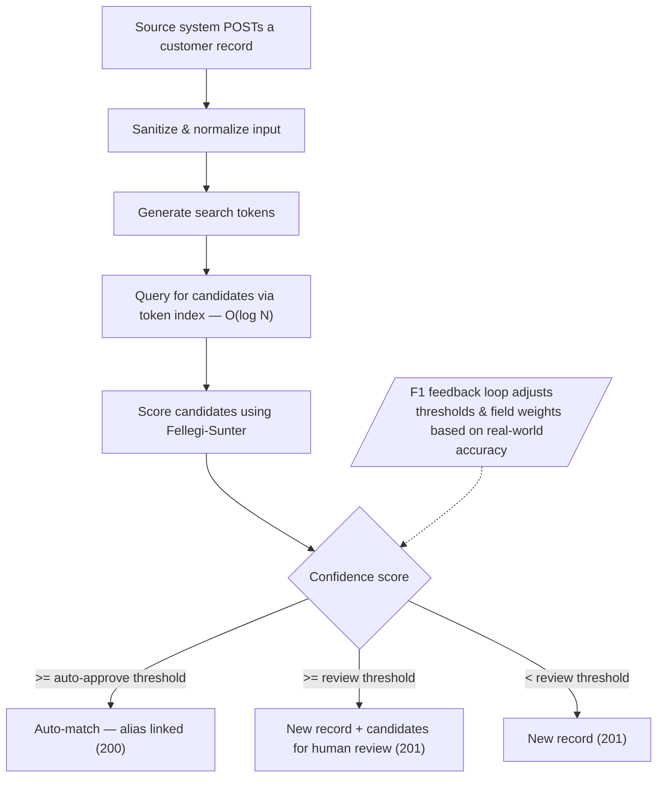

# S14S Identify — Summary

**Enterprise Identifier Registry** — a REST API that consolidates customer identities across multiple source systems using probabilistic record linkage.

## The Problem

When different systems (CRM, billing, support, etc.) each maintain their own customer records, the same person ends up with multiple disconnected profiles. There is no single source of truth, and no reliable way to know whether "Chuck Smith" in the CRM is the same person as "Charles Smith" in billing.

## How It Works



Source systems POST freely without worrying about duplicates. The matching engine handles deduplication automatically. Thresholds start conservative (95% auto-approve, 70% review) and are tuned over time by the F1 feedback loop as false positive and false negative reports accumulate.

## Key Capabilities

- **Probabilistic matching** — Fellegi-Sunter model with Jaro-Winkler fuzzy string comparison for names and addresses
- **Source system registration** — each source must register before submitting records; aliases trace back to their origin
- **Three-tier match decisions** — auto-match, flag for review, or create new record based on confidence score
- **Candidate review workflow** — near-miss matches are surfaced for human approve/reject decisions
- **F1 feedback loop** — precision, recall, and F1 metrics computed from real-world feedback; weight tuning suggestions keep accuracy improving over time
- **Nickname normalization** — ~130 common nicknames mapped to formal equivalents ("Chuck" → "Charles") with originals preserved
- **Input sanitization** — E.164 phone normalization, USPS Pub 28 address standardization, email validation
- **Typeahead search** — prefix-token-based name search optimized for large datasets, O(log N)
- **Phonetic blocking** — Double Metaphone tokens ensure "Smith" and "Schmidt" surface as candidates for each other
- **Full audit trail** — field-level change deltas with who/when/what on every mutation
- **Atomic merges** — MongoDB transactions guarantee all-or-nothing semantics when merging records
- **Soft deletes** — records are never physically removed; merged records return 301 redirects to the master

## API at a Glance

| Resource | Endpoints | Purpose |
|----------|-----------|---------|
| `/sources` | CRUD | Register and manage source systems |
| `/customers` | CRUD + search | Create, match, update, merge, and search customers |
| `/customers/:id/aliases` | GET | View cross-system identity links |
| `/customers/:id/changes` | GET | View audit history |
| `/customers/:id/aliases/:aliasId/feedback` | POST | Report false positive matches |
| `/customers/:id/aliases/:aliasId/candidates` | GET, approve, reject | Review near-miss match candidates |
| `/match-quality` | GET | F1 score, precision, recall metrics |
| `/match-quality/tune` | GET | Weight adjustment suggestions |

## Tech Stack

Node.js, Express, MongoDB (replica set for transactions), Mongoose

## Getting Started

```bash
npm install
docker compose up -d
npm run seed    # 1000 sample customers
npm start       # Swagger UI at http://localhost:3000/api-docs
npm test        # 334 tests, 100% coverage enforced
```

## Full Documentation

See [README.md](README.md) for complete technical documentation including algorithm details, field configurations, mermaid flow diagrams, data model schemas, and architecture.
